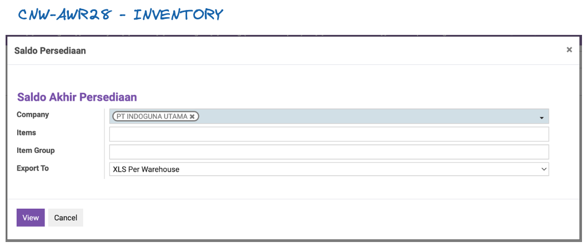

# Prosedur Inventory
  
## TEAN INVENTORY
 
* Melakukan inventory di masing masing gudang

## WAREHOUSE

* Memindahkan semua stock virtual ( booking ) ke Warehouse Utama


## IT

* Tarik laporan OnHand stock semua gudang
* Tarik laporan OnHand stock total
* Pindahkan ```cetakan DO``` ke modul SO
* Generate template stockOpname per group barang

**[Laporan on hand per gudang]**




**[Laporan on hand]**


