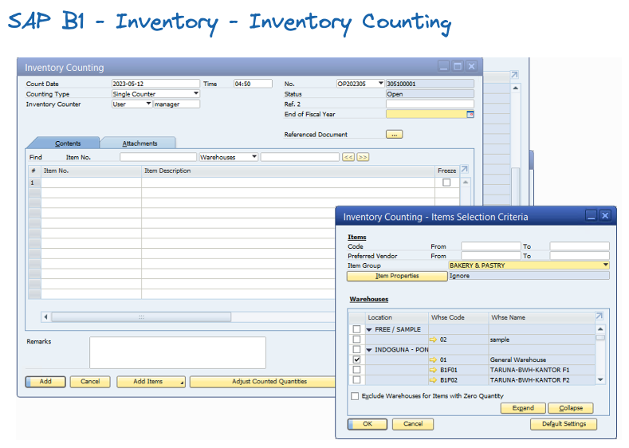
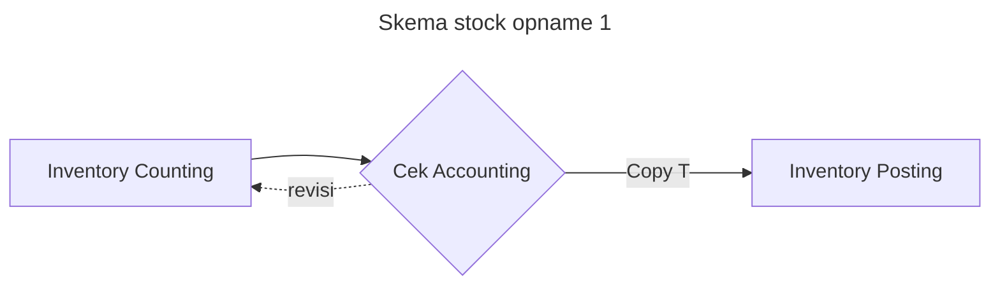

# Prosedur Setelah Inventory


## Warehosue

* Melakukan rekap dan perhitungan Opname


## IT 

### SAP WEB

* Bypass rules dengan mengupdate status barang menjadi ```MTO``` ( Make To Order )
* Aktifkan cetakan ```DO``` di module sales order


### INVENTORY COUNTING

#### SKEMA 1

SKEMA 1 Mengggunakan SAP B1 inventory Counting modul.

* Generate semua Item untuk melakukan inventory ccounting, berdasarkan group barang


**[generate template stock opname]**




* Set **Freeze** semua item di module inventory counting, agar tidak ada transaksi  stock yang masuk

* Input semua data opname di inventory counting
* Setelah selesai  pihak accounting cek nilai, dan setelah disetujui management terkait, lakukan ```copy to inventory posting```




